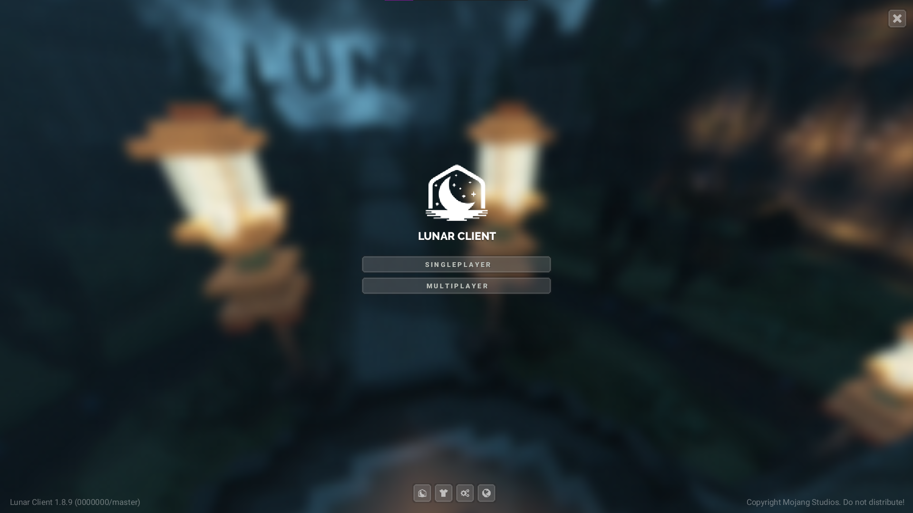

# Lunar-Client-Main-Menu
An almost perfect copy of the Lunar Client's main menu. I used minecrafts's gui renderer so it looks a bit wacky.

### Showcase

### Usage
* Put the ``lunar`` folder into ``assets/minecraft/``
* Add the ``me.hobbyshop.lunar`` package to your project.
I don't know why you would want to use this seriously
